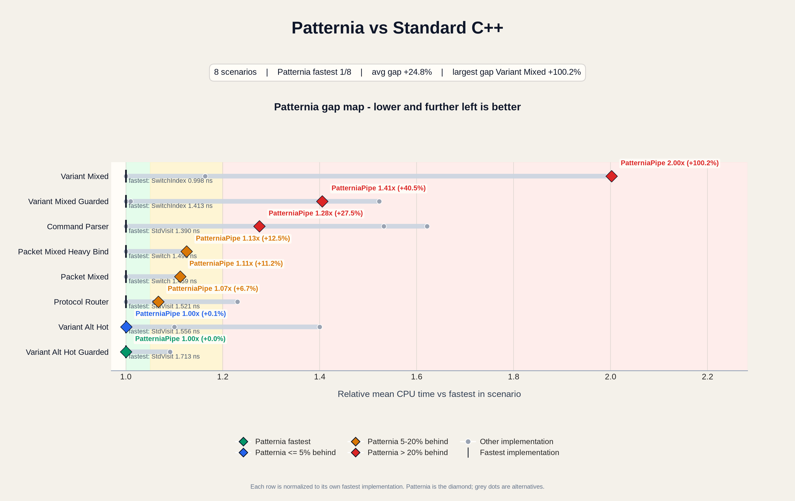

<div align="center">
  <picture>
    <source media="(prefers-color-scheme: dark)"
            srcset="https://wordpress-1316673449.cos.ap-beijing.myqcloud.com/img/banner-dark.svg">
    <source media="(prefers-color-scheme: light)"
            srcset="https://wordpress-1316673449.cos.ap-beijing.myqcloud.com/img/banner-dark.svg">
    
  </picture>
</div>

<br>

<div align="center">

[](https://isocpp.org/)
[](https://github.com/SentoMK/patternia/actions)
[](LICENSE)
[](https://github.com/SentoMK/patternia/releases)
[](https://codecov.io/gh/SentoMK/patternia)
[](https://patternia.tech)

</div>

<br>

**Patternia** is a header-only pattern matching library for modern C++.
It keeps matching expression-oriented, explicit, and zero-overhead.

> Compile-time literal matching uses `val<V>`.
> Runtime literal matching remains `lit(value)` and `lit_ci(value)`.

## Syntax

```cpp
#include <ptn/patternia.hpp>

int classify(int x) {
  using namespace ptn;

  return match(x) | on(
    lit(0) >> 0,
    lit(1) >> 1,
    _ >> -1
  );
}
```

`match(subject)` creates the evaluation context.
`on(...)` provides the ordered case list.
`pattern >> handler` defines one case.
`_` is the required fallback case.

## Highlights

- Literal, structural, and `std::variant` matching in one DSL.
- Explicit binding through `$` and `$(...)`.
- Declarative guards via `_`, `PTN_BIND`, `rng(...)`, and callables.
- No RTTI, no virtual dispatch, no heap allocation.
- Static literal and variant dispatch lowering for hot paths.

## Quick Examples

### Guarded value match

```cpp
using namespace ptn;

const char *bucket(int x) {
  return match(x) | on(
    $[_ < 0] >> "negative",
    $[_ < 10] >> "small",
    _ >> "large"
  );
}
```

### Structural match

```cpp
using namespace ptn;

struct Point { int x; int y; };

int magnitude2(const Point &p) {
  return match(p) | on(
    $(has<&Point::x, &Point::y>) >> [](int x, int y) {
      return x * x + y * y;
    },
    _ >> 0
  );
}
```

### Structural match with named placeholders

Declare readable names once with `PTN_BIND` (one to ten names), then
use them directly in guard expressions:

```cpp
using namespace ptn;

struct Point { int x; int y; };
PTN_BIND(Point, x, y);

bool on_circle_radius5(const Point &p) {
  return match(p) | on(
    $(has<&Point::x, &Point::y>)[x * x + y * y == 25] >> true,
    _ >> false
  );
}
```

### Variant match

```cpp
using namespace ptn;

using Value = std::variant<int, std::string>;

std::string describe(const Value &v) {
  return match(v) | on(
    is<int> >> "int",
    $(is<std::string>) >> [](const std::string &s) {
      return "str:" + s;
    },
    _ >> [] { return std::string("other"); }
  );
}
```

### Negation match

```cpp
// Negation: match values NOT equal to specific literals
int status = 404;
auto msg = match(status) | on(
    neg(val<200>) >> []{ return std::string("error"); },
    _             >> []{ return std::string("ok"); }
);
// msg == "error" — status isn't 200
```

## Installation

Patternia is header-only with no external dependencies.

**vcpkg** (recommended):

```bash
vcpkg install patternia
```

```cmake
find_package(patternia CONFIG REQUIRED)
target_link_libraries(your_target PRIVATE patternia::patternia)
```

**FetchContent**:

```cmake
include(FetchContent)
FetchContent_Declare(patternia
  GIT_REPOSITORY https://github.com/sentomk/patternia.git
  GIT_TAG v0.9.3
)
FetchContent_MakeAvailable(patternia)

target_link_libraries(your_target PRIVATE patternia::patternia)
```

**Direct clone**:

```bash
git clone https://github.com/SentoMK/patternia.git
cd patternia
cmake -S . -B build
cmake --build build
```

See [Installation Guide](https://patternia.tech/guide/installation/) for `find_package`, submodule, and header-copy options.

## Tests

```bash
cmake -S . -B build -DPTN_BUILD_TESTS=ON
cmake --build build --target ptn_tests
ctest --test-dir build --output-on-failure
```

## Benchmarks

<p align="center">
  
</p>

<p align="center"><em>Patternia gap map across key scenarios. Each row is normalized to the fastest implementation in that scenario.</em></p>

See [Performance Notes](https://patternia.tech/performance/) for full reports and methodology.

## Performance-Oriented Usage

Cache the case pack for repeated hot paths:

```cpp
using namespace ptn;

int fast_classify(int x) {
  return match(x) | PTN_ON(
    val<1> >> 1,
    val<2> >> 2,
    _ >> 0
  );
}
```

`PTN_ON(...)` is a convenience wrapper over `static_on(...)`.
It avoids rebuilding the matcher object on every call.

## Documentation

- [Getting Started](https://patternia.tech/guide/getting-started/)
- [API Reference](https://patternia.tech/api/)
- [Design Overview](https://patternia.tech/design-overview/)
- [Tutorials](https://patternia.tech/tutorials/from-control-flow/)
- [Performance Notes](https://patternia.tech/performance/)

## Contributing

Please read [CONTRIBUTING.md](CONTRIBUTING.md) before sending changes.
This project is governed by [CODE_OF_CONDUCT.md](CODE_OF_CONDUCT.md).
