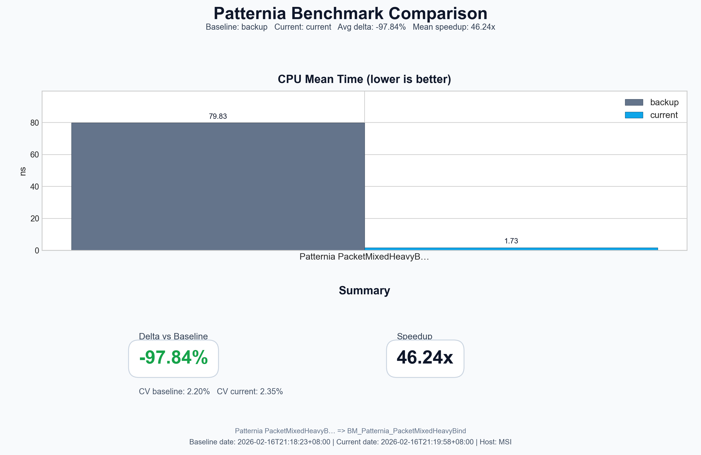

# Patternia v0.7.3 Release Note

**Release Date:** February 16, 2026  
**Version:** 0.7.3

---

<h1>🎆Happy Chinese NewYear!🎆</h1>

## Overview

Patternia v0.7.3 is a performance-focused patch release. Compared with v0.7.2,
this version reduces unnecessary value copies in binding paths and adds a
repeatable heavy-bind benchmark workflow for regression tracking.

---

## Highlights

### Binding Path Performance Optimization
- `bind()` now binds the subject by reference instead of materializing an
  eager value copy.
- `bind(subpattern)` now composes the subject binding by reference with
  subpattern bindings.
- Structural binding (`bind(has<...>)`) now binds member fields by reference,
  avoiding extra copies for large payload members.

### Heavy-Bind Benchmark Scenario
- Added `BM_Patternia_PacketMixedHeavyBind` to stress large payload binding
  paths where copy/reference behavior is most visible.
- Added `BM_Switch_PacketMixedHeavyBind` as baseline for the same workload.

### Benchmark Comparison Tooling
- Added `scripts/bench_stage_results.py` to normalize two `result.json` files
  into a standard local layout.
- Added/updated `scripts/bench_compare.py` to render chart + markdown reports
  with labels, filtering, and single-benchmark summary layout.

---

## Performance Comparison vs v0.7.2

For the heavy-bind scenario (`PacketMixedHeavyBind`), v0.7.3 is designed to
highlight the effect of copy elimination in binding paths.

Reference visualization generated from local compare workflow:

> Note: absolute numbers vary by machine and run conditions. Use the staged
> compare scripts to evaluate your local baseline and current build under the
> same environment.

---

## Compatibility Notes

- API surface: unchanged.
- Source compatibility: generally unchanged.
- Behavioral detail: bindings from `bind()`/structural bind paths are now
  reference-oriented by default, reducing implicit copies.

---

## Implementation Notes

- `include/ptn/pattern/bind.hpp`
  - Updated binding construction to reference-based tuples.
- `bench/bench_match_variant.cpp`
  - Added heavy-bind packet workload and benchmark pairs.
- `scripts/bench_stage_results.py`
  - Added benchmark result staging utility.
- `scripts/bench_compare.py`
  - Added improved comparison rendering and filtering.
