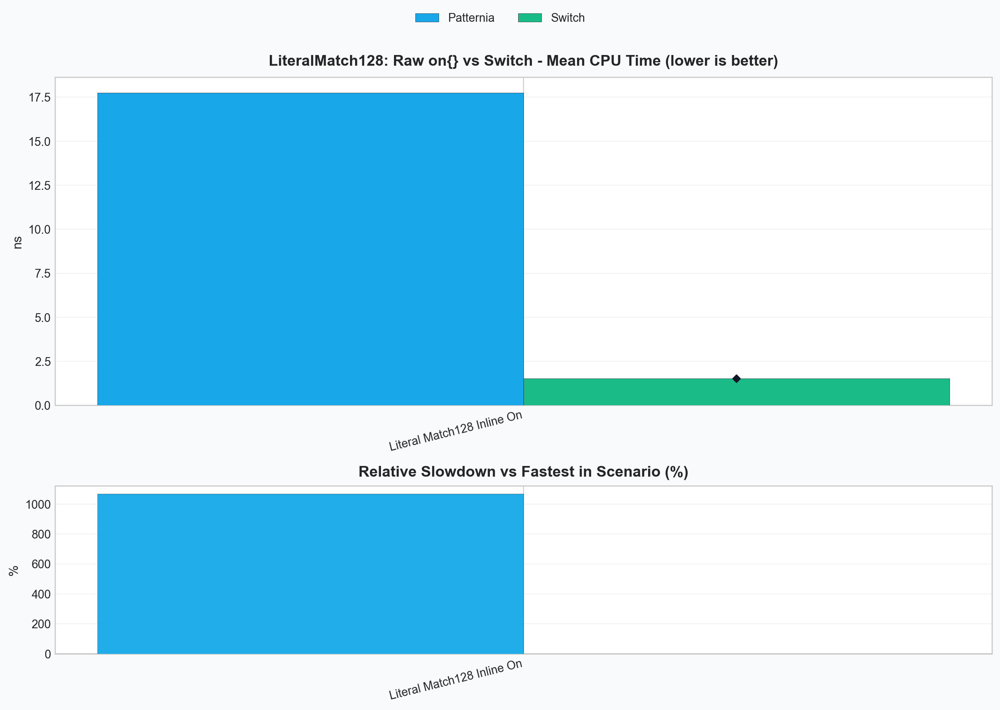
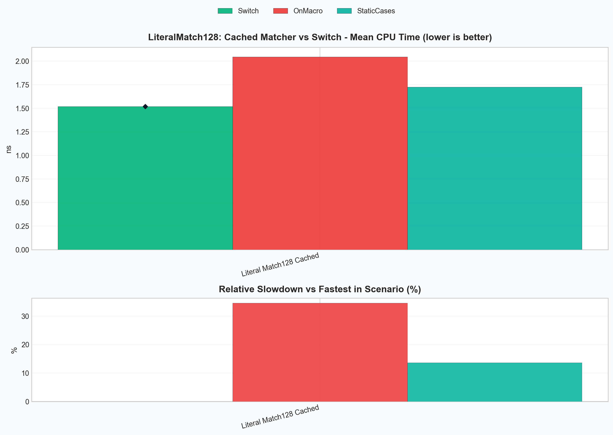

# Patternia Performance - v0.8.2

**Published**: 2026-03-03

**Focus**:

- establish the lowering engine as the main optimization architecture
- push static literal dispatch closer to the `switch` baseline
- separate dispatch quality from matcher-construction overhead

## Summary

v0.8.2 moves Patternia's performance work from isolated fast paths to a
general lowering engine.

This version focuses on one practical target:

- make keyed pattern chains behave as closely as possible to hand-written
  `switch` code
- keep the optimization scalable beyond one special-case pattern family
- reduce the matcher-construction overhead that appears in
  `match(x) | on(...)`

The result is a two-part improvement:

- the compiler-visible static literal path is now close to the `switch`
  baseline
- the pipeline syntax can reuse a cached matcher through `static_on(...)` or
  `PTN_ON(...)`

The benchmark discussion in this note uses the 128-way literal scenario
because it is large enough to expose both sides of the problem:

- how close lowering gets to hand-written control flow
- how expensive raw inline matcher construction still is

---

## Benchmark Snapshot

### Raw pipeline form vs `switch`

This chart answers the simple question: what happens if you write the direct
pipeline form and call it in a hot loop?



### Cached matcher forms vs `switch`

This chart isolates the same 128-way static-literal workload after matcher
construction is moved out of the hot path.



---

## Problems We Needed To Solve

### Problem 1: Runtime literal factories hide the dispatch key

`lit(value)` is a general runtime factory.

That is the right API for dynamic values and strings, but it means the
lowering stage cannot see the literal as a compile-time key:

```cpp
match(x) | on(
  lit(1) >> 1,
  lit(2) >> 2,
  __ >> 0
);
```

For this shape, Patternia can still build a specialized linear literal path,
but it cannot reliably target switch-like lowering.

### Problem 2: `match(x) | on(...)` pays matcher construction cost every call

Even when the match logic itself lowers well, the inline pipeline form still
constructs the whole matcher object on every evaluation:

```cpp
match(x) | on(
  lit<1>() >> 1,
  lit<2>() >> 2,
  __ >> 0
);
```

For large case sets, this construction cost dominates the dispatch cost.

### Problem 3: Optimization logic did not scale

Before v0.8.2, performance logic was drifting toward isolated special cases in
`optimize.hpp` and `eval.hpp`.

That approach does not scale for future keyed scenarios such as:

- static literals
- simple variant alternative dispatch
- guarded variant cases that still expose a primary key

Patternia needed a shared lowering model, not one more fast path.

---

## Initial Solution

The first step was to expose a compile-time literal form:

```cpp
lit<42>()
```

This gives the lowering stage a stable key that can move into type-level
metadata and plan selection.

The second step was to validate the idea with a narrow benchmark:

- 128 static literal cases
- one trailing wildcard default
- direct comparison against a hand-written `switch`

That experiment confirmed two separate facts:

- static keyed lowering works
- raw `match(x) | on(...)` still loses badly if matcher construction remains in
  the hot path

That is why v0.8.2 treats lowering and matcher reuse as separate concerns.

---

## Lowering Engine Architecture

v0.8.2 organizes the optimizer around a small internal pipeline:

```text
case DSL
  -> case_analysis
  -> case_sequence_ir
  -> lowering_analysis
  -> dispatch_plan
  -> eval_cases_with_dispatch_plan(...)
```

The main pieces are:

| Component | Responsibility |
| --- | --- |
| `case_analysis` | Analyze one case into discriminator, residual work, and binding shape |
| `case_sequence_ir` | Aggregate the full case chain and decide whether lowering is legal |
| `lowering_analysis` | Expose legality and plan-family signals to the planner |
| `dispatch_plan` | Carry the concrete execution shape selected for the evaluator |
| `eval_cases_with_dispatch_plan(...)` | Execute the chosen plan without re-running planner logic |

The design is built around three legality grades:

| Rule | Meaning | Current result |
| --- | --- | --- |
| `full` | The key alone can drive the dispatch path | direct lowering |
| `bucketed` | The key narrows the search, but some residual replay remains | per-key bucket replay |
| `none` | The planner cannot prove a safe keyed path | sequential evaluation |

In code, this lives in:

- [optimize.hpp](C:/Users/SentoMK/code/patternia/include/ptn/core/common/optimize.hpp)
- [eval.hpp](C:/Users/SentoMK/code/patternia/include/ptn/core/common/eval.hpp)

---

## Algorithms and Principles

### 1. Dense static-literal lowering

This is the main new `full` path in v0.8.2.

Patternia first checks whether the case chain is a good dense-key candidate.
The current heuristics are:

- subject type is integral or enum
- every case is a zero-bind static literal or the trailing wildcard default
- case count is at most `256`
- key span is at most `512`
- key span is dense enough relative to case count

If those checks pass, the planner selects:

- `dispatch_plan_kind::static_literal_dense`

The metadata computes:

- `min_value`
- `max_value`
- `range_size`
- `default_case_index`
- compile-time `case_index_table`

At runtime, the hot path becomes:

```text
value
  -> range check
  -> offset = value - min_value
  -> switch(offset)
  -> selected case entry or default
```

### Example: sparse values inside a small span

For:

```cpp
match(x) | on(
  lit<1>()  >> 1,
  lit<2>()  >> 2,
  lit<10>() >> 10,
  __        >> 0
);
```

Patternia computes:

- `min_value = 1`
- `max_value = 10`
- `range_size = 10`

The dense metadata conceptually maps offsets like this:

| Value | Offset | Selected branch |
| --- | --- | --- |
| `1` | `0` | case `lit<1>()` |
| `2` | `1` | case `lit<2>()` |
| `3..9` | `2..8` | default |
| `10` | `9` | case `lit<10>()` |

This is why the generated path is much closer to `switch` than a generic
pattern replay loop.

### 2. Variant keyed dispatch with bucket replay

The lowering engine is not literal-only.

Variant dispatch is now expressed through the same planner structure:

- `variant_simple`
- `variant_alt_bucketed`

The `full` case is straightforward:

```cpp
match(v) | on(
  type::alt<0>() >> 1,
  type::alt<1>() >> 2,
  __ >> 0
);
```

The active alternative is already the dispatch key, so no residual work is
needed.

The `bucketed` case appears when the alternative is still useful, but one key
maps to multiple residual checks:

```cpp
match(v) | on(
  type::is<int>()[_0 > 100] >> 10,
  type::is<int>()          >> 1,
  type::is<std::string>()  >> 2,
  __                       >> 0
);
```

Here, the active `variant` alternative narrows the search immediately:

- `int` -> replay only the `int` bucket
- `std::string` -> replay only the string bucket

This preserves first-match semantics while avoiding a full-chain scan.

### 3. Matcher reuse for pipeline syntax

Lowering alone is not enough if the matcher object is rebuilt every time.

That is why v0.8.2 also adds a reusable pipeline form:

```cpp
match(x) | PTN_ON(
  lit<1>() >> 1,
  lit<2>() >> 2,
  __ >> 0
);
```

`PTN_ON(...)` is a convenience wrapper around:

```cpp
match(x) | static_on([] {
  return on(
    lit<1>() >> 1,
    lit<2>() >> 2,
    __ >> 0
  );
});
```

This keeps the pipeline syntax while moving matcher construction out of the
hot path.

---

## Worked Example: Why Raw `on(...)` Is Still Slow

Consider the three 128-way forms used by the benchmark:

### Inline matcher

```cpp
match(x) | on(
  lit<1>() >> 1,
  // ...
  lit<128>() >> 128,
  __ >> 0
);
```

This form pays for:

- case object construction
- value-handler object construction
- `on(...)` tuple construction

on every call.

### Manually cached matcher

```cpp
static auto cases = on(
  lit<1>() >> 1,
  // ...
  lit<128>() >> 128,
  __ >> 0
);

return match(x) | cases;
```

This keeps the lowering path identical, but it removes repeated matcher
construction.

### Cached pipeline matcher

```cpp
match(x) | PTN_ON(
  lit<1>() >> 1,
  // ...
  lit<128>() >> 128,
  __ >> 0
);
```

This is the same reuse idea packaged for pipeline syntax.

---

## Final Results

The following numbers come from the current local run of:

```powershell
.\build\bench\ptn_bench_lit.exe --benchmark_filter="LiteralMatch128" --benchmark_min_time=0.5s
```

| Benchmark | Meaning | CPU time |
| --- | --- | --- |
| `BM_PatterniaPipe_LiteralMatch128StaticCases` | prebuilt matcher object | `1.74 ns` |
| `BM_PatterniaPipe_LiteralMatch128On` | raw inline `on(...)` | `17.9 ns` |
| `BM_PatterniaPipe_LiteralMatch128OnMacro` | cached pipeline matcher via `PTN_ON(...)` | `2.09 ns` |
| `BM_Switch_LiteralMatch128` | hand-written `switch` baseline | `1.52 ns` |

### What these numbers mean

- The static literal lowering itself is close to the `switch` baseline.
- The dominant remaining gap in the raw pipeline form is matcher construction,
  not keyed dispatch.
- `PTN_ON(...)` recovers most of the lost performance while keeping the
  pipeline syntax.

In practice, the current result is:

- `StaticCases` is about `1.14x` the `switch` baseline
- `PTN_ON(...)` is about `1.37x` the `switch` baseline
- raw `on(...)` is roughly `11.8x` slower than the `switch` baseline in this
  benchmark because it rebuilds the matcher every call

---

## Outcome

v0.8.2 establishes the lowering engine as an internal architecture, not just a
collection of local optimizations.

It delivers five concrete outcomes:

1. `lit<value>()` now has a real switch-oriented lowering path.
2. The engine has a shared legality model: `full`, `bucketed`, and `none`.
3. Variant dispatch and static literal dispatch now live under the same plan
   model.
4. `PTN_ON(...)` provides a practical pipeline form that avoids repeated
   matcher construction.
5. The performance gap to hand-written `switch` is now small enough that
   future work can focus on fewer, more specific remaining costs.

For API-level release notes, see [v0.8.2](../changelog/v0.8.2.md).
